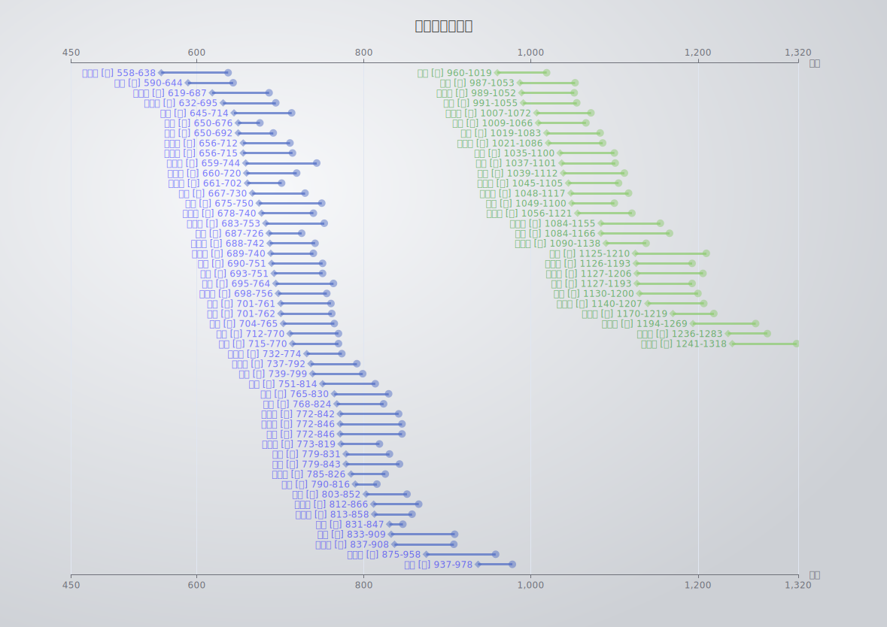

唐宋诗人的年代顺序

## 1 Overview

## 2 How to run

You don't need to install anything; simply open "index.html" directly in your web browser.

## 3 How to update data

1. edit data/in.csv - 根据格式进行增改
2. run era.py - 生成data.js
3. open index.html with broswer

